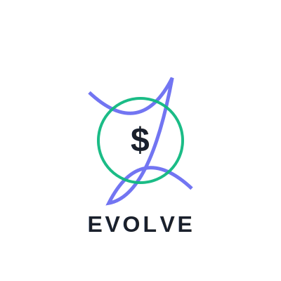

# 🧬 EVOLVE Protocol

<div align="center">
  
</div>

A self-optimizing blockchain protocol with evolutionary governance mechanisms.

## 🌟 Overview

EVOLVE is the first truly adaptive meme token that evolves through AI-driven mutations and community governance. It implements biological evolution principles in token economics, creating a living digital asset that adapts to market conditions in real-time.

## ✨ Features

### Core Features
- 🧬 Dynamic Parameter Mutation
  - AI-driven mutation proposals
  - 24-hour evolution cycles
  - Adaptive burn rate (1-10%)
  - Visual DNA evolution

### Governance
- 🌐 Cross-chain Governance
  - Multi-tiered voting structure
  - Time-lock bonuses
  - Activity multipliers
  - Delegation system

### Performance
- ⚡ High-performance Consensus
  - 2500+ TPS
  - Optimized state management
  - Efficient mutation processing
  - Real-time updates

### Security
- 🔒 Zero-knowledge Proof Integration
  - Privacy-preserving voting
  - Secure mutation verification
  - Protected evolution history
  - Confidential adaptations

### Architecture
- 🧩 Modular Architecture
  - Pluggable components
  - Extensible mutation system
  - Customizable evolution rules
  - Flexible integration options

## 🚀 Quick Start

### Prerequisites
```bash
# Required versions
Node.js >= v16
Python >= 3.8
Solidity >= 0.8.0
```

### Installation
```bash
# Clone repository
git clone https://github.com/evolveaicom/EVOLVE.git
cd EVOLVE

# Install dependencies
npm install
pip install -r requirements.txt

# Setup environment
cp .env.example .env
```

### Development Setup
```bash
# Start local blockchain
npx hardhat node

# Deploy contracts
npx hardhat deploy --network localhost

# Start AI engine
python ai_oracle/main.py

# Run frontend
npm run dev
```

## 📚 Documentation

### Core Documentation
- [Technical Whitepaper](docs/whitepaper.md)
- [API Reference](docs/API.md)
- [Developer Guide](docs/DEVELOPERS.md)

### Additional Resources
- [Architecture Overview](docs/ARCHITECTURE.md)
- [Contribution Guide](docs/CONTRIBUTING.md)
- [Security Model](docs/SECURITY.md)
- [Evolution Mechanics](docs/EVOLUTION.md)

## 🧪 Testing

### Smart Contract Tests
```bash
# Run all tests
npx hardhat test

# Run specific test file
npx hardhat test test/evolution.test.ts

# Run with coverage
npx hardhat coverage
```

### AI Engine Tests
```bash
# Run Python tests
python -m pytest tests/

# Run specific test file
python -m pytest tests/ai_engine_test.py
```

### Frontend Tests
```bash
# Run React component tests
npm test

# Run with coverage
npm test -- --coverage
```

## 🔧 Configuration

### Environment Variables
```env
# Network Configuration
NETWORK=mainnet
INFURA_KEY=your_infura_key
PRIVATE_KEY=your_private_key

# AI Engine Configuration
OPENAI_API_KEY=your_openai_key
HUGGINGFACE_API_KEY=your_huggingface_key

# Frontend Configuration
NEXT_PUBLIC_API_URL=http://localhost:3000
NEXT_PUBLIC_CHAIN_ID=1
```

### Smart Contract Parameters
```solidity
uint256 public constant MUTATION_CYCLE = 1 days;
uint256 public constant MIN_SURVIVAL_RATE = 20;
uint256 public constant MAX_BURN_RATE = 10;
```

## 🛠 Development

### Architecture Overview
```
evolve-protocol/
├── contracts/          # Smart contracts
├── programs/          # Solana programs
├── ai_oracle/         # AI mutation engine
├── components/        # React components
├── hooks/            # Custom React hooks
├── tests/            # Test suites
└── docs/             # Documentation
```

### Key Components
1. **Smart Contracts**: Core evolution and governance logic
2. **AI Oracle**: Mutation generation and market analysis
3. **Frontend**: Interactive evolution visualization
4. **Tests**: Comprehensive test coverage

## 🤝 Contributing

### How to Contribute
1. Fork the repository
2. Create a feature branch
3. Commit your changes
4. Submit a pull request

### Development Guidelines
- Follow code style guidelines
- Write comprehensive tests
- Update documentation
- Add inline comments

## 🔐 Security

### Security Measures
- Multi-signature controls
- Time-lock mechanisms
- Emergency pause functionality
- Regular security audits

### Reporting Issues
- Submit security issues to EVOLVE_AI@hotmail.com
- Include detailed reproduction steps
- Provide environment information

## 🌍 Community

Follow us on Twitter: [@MemeEVOLVE_AI](https://x.com/MemeEVOLVE_AI)

## 📅 Roadmap

### Q2 2025
- Launch mainnet beta
- Implement cross-chain governance
- Release advanced visualization tools

### Q3 2025
- Enable multi-token evolution
- Launch ecosystem grants
- Expand AI capabilities

### Q4 2025
- Implement advanced adaptation models
- Launch mobile applications
- Expand to additional chains

## 📄 License

AGPL-3.0 © 2023 EVOLVE DAO

## ⚠️ Disclaimer

This project is in beta. Use at your own risk.

## 🙏 Acknowledgments

Special thanks to:
- OpenZeppelin for security foundations
- HuggingFace for AI models
- Three.js for visualization
- The entire EVOLVE community
